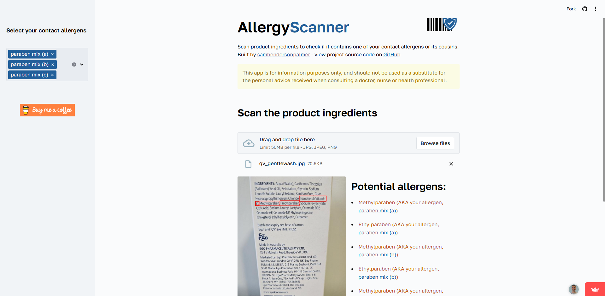
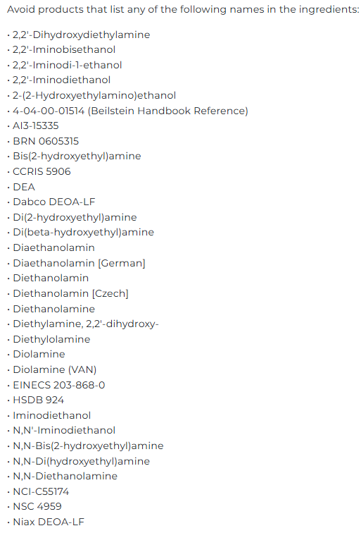

> [!CAUTION]
> This app is for information purposes only, and should not be used as a substitute for the personal advice received when consulting a doctor, nurse or health professional.

## [AllergyScanner](https://allergyscanner.streamlit.app/)

### Quickly scan the ingredients of cosmetic products to flag up your potential allergens.

I'm a long-time eczema sufferer as are some of my family members and friends. I wanted to build an open source tool that allows you to quickly input your known allergens, take a picture of the ingredients of a product you're interested in and highlight any potential allergens or cross-reactions.

## Why is this needed?

You have gone through the rigmarole of seeing dermatologists and undergoing the very strange experience of patch testing. Now you’re left with a shoddy print-out of a badly designed website page listing the specific chemicals you have been found to have a contact allergy to. 

Helpfully these contact allergens each have about 20 names they go by in the real world which makes it an absolute nightmare choosing products that won’t set you off. 

The chemical ‘Diethanolamine’ might’ve been found to be the cause of your misery. That’s a cause to celebrate until you realise you have to be on the lookout for its many stage names below for the rest of your life:

This app lets you select your allergen(s) as you know it, take a picture of your product ingredients list and then highlights if it appears under any other name.

## How you can help
The easyOCR model and processing of images taken from a mobile device make the memory demands of this app quite heavy (around 6GB) which Streamlit Community Cloud can’t currently support on its free tier. I've monitored memory usage and can reduce it by reducing resolution of images but I’ve had to do this at the expense of accuracy of OCR. **The utility of the app to the eczema community depends on the accuracy.** 

**Please help by:**

- Offering technical advice to get around this or make it more efficient?
- Streamlit offers increased resources for apps with ‘good-for-the-world use cases’ but haven’t got back to me. Pester them with another request [here](https://info.snowflake.com/streamlit-resource-increase-request.html).

Cheers,

Sam

